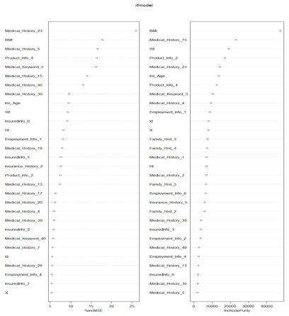
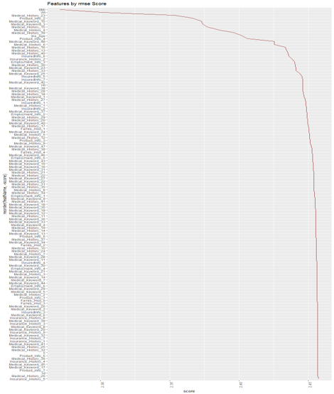

# Prudential-Life-Insurance-Assessment

## Data Set
[GitHub] https://www.kaggle.com/c/prudential-life-insurance-assessment/data
- The dataset provides hundred variables as attributes to predict the result “response” variable for each id. “Response” has 8 levels as measure of risk

## Motivation
- Due to extensive information of identifying risk classification and eligibility, the results have been bounded in life insurance application processes
- Lack of automated approach results in degradation of public interest in the industry
- Around 40% of US households own individual life insurance

## Step
### Data Cleaning and preprocessing

1. Categorizing the data
2. Scaling the data
3. Converting categorical values into numberic values
4. Converting binary columns in 1_0 
5. Imputing data
6. Continuous data with median
7. Discrete data with mode

### Linear Regression
Linear Regression is an approach for modeling the relationship between a scalar dependent variable y and one or more explanatory variables denoted X
1. Observe Response which represents the degree of one risk from 1 to 8
2. Feature selection: 3 attempts  
  1.1. First Attempt: Random Forest  
    
  1.2. Second Attempt: RMSE score  
    
  1.3. Third Attempt: Cross Validation  
    
3. Build model and do prediction
4. R packages: library(forecast) ,library(dplyr), library(randomForest),library(caret), library(ggplot2)

### Decision Tree
A decision tree is a decision support tool that uses a tree like model of decisions and their possible consequences 
1. Prevents overfitting
2. Continuous variable
3. Handles training examples with missing attributes 
4. R packages: library(forecast) ,library(rpart), library(randomForest),library(caret), library(rpart.plot),library(RColorBrewer)

### SVM
A Support Vector Machine (SVM) is a discriminative classifier formally defined by a separating hyperplane.
1. We tune the SVM model to find the optimum value of the gamma and cost value be used for the SVM model with the kernel
2. After finding the optimum gamma and cost value, we implement it on the actual SVM model.
3. R packages: library(caret), library(e1071)

## Conclusion
I use RMSD(Root Mean Square Error) to measure the differences between values predicted by a model and the values actually observed.
- Linear Regression: 1.994
- Decision Tree: 1.12
- SVM Regression: 2.23

